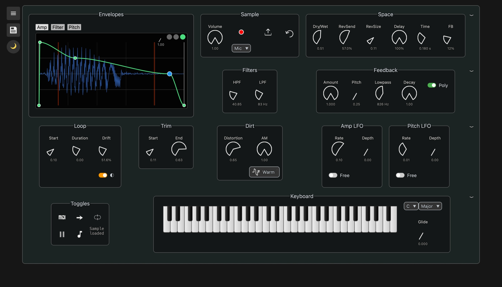
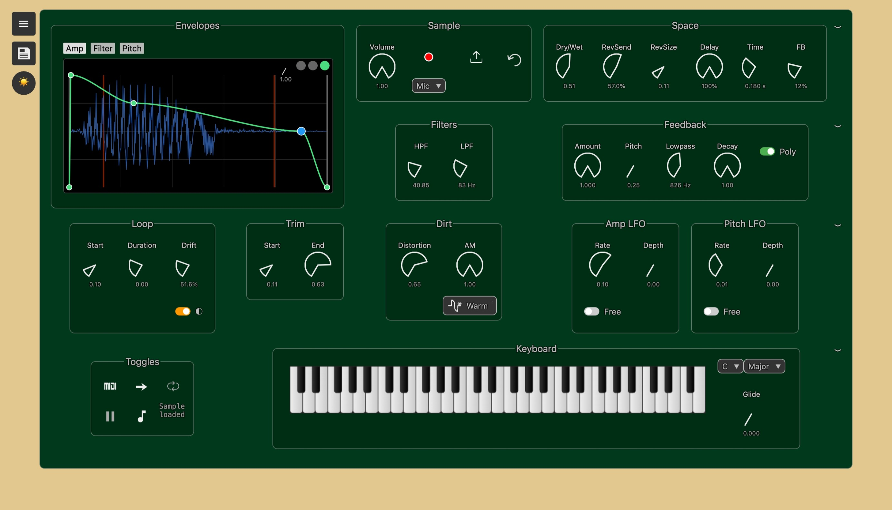

# Hljóð-Smali 🎹

> A web-based audio sampler built with TypeScript and the Web Audio API. Record samples and play them back using your keyboard.

[](https://www.typescriptlang.org/)
[](LICENSE)

🎹 **[Try the Live Demo](https://kristinnroach.github.io/sampler-monorepo/)**

---

### Screenshots

<p align="center">
  
  <br>
  <em>Dark theme with envelope editor, waveform display, and effects controls</em>
</p>

<p align="center">
  
  <br>
  <em>Light theme showing the same interface</em>
</p>

---

## Overview

**Hljóð-Smali** (Icelandic for "Sound-Sampler") is a browser-based audio sampler that lets you record audio samples and play them back like a musical instrument. Built as a TypeScript monorepo, it demonstrates practical applications of Web Audio API, Audio Worklets, and modern web component architecture.

### Why I Built This

I wanted to understand how audio production tools work under the hood and explore the Web Audio API's capabilities. This project gave me hands-on experience with:

- Real-time audio processing using Audio Worklets
- Building framework-agnostic web components that work with vanilla JS, React, and SolidJS
- Managing complex audio state and parameter changes
- Working within browser constraints (async audio context, CORS, latency)

---

## Features

### Audio Engine

- 🎤 Real-time audio recording from microphone
- 🎹 Polyphonic playback with keyboard control
- 🔊 ADSR envelope with visual editing
- 🔄 Sample looping with adjustable loop points
- 🎚️ Built-in effects (reverb, filters, LFO modulation)
- 🎵 Pitch detection for auto-tuning samples

### UI Components

- 📊 Waveform visualization
- 🎛️ Custom knobs and sliders (built as web components)
- ⌨️ Keyboard-to-note mapping
- 💾 IndexedDB sample storage

---

## Tech Stack

- **TypeScript** - Strict type checking throughout
- **Web Audio API** - Core audio processing
- **Audio Worklets** - Real-time sample playback
- **Vite** - Build tooling
- **TurboRepo** - Monorepo management
- **SolidJS** - Main app UI framework
- **React** - Component wrapper support
- **Vitest + Playwright** - Testing (50+ test files)

---

## Technical Details

### Audio Worklet Processors

Custom audio worklet processors handle real-time sample playback with interpolation for pitch shifting, envelope modulation, and frame-accurate loop points.

### Framework-Agnostic Components

Web components are built in vanilla JS and wrapped for React and SolidJS, allowing the same component code to work across different frameworks.

### Monorepo Structure

Organized with TurboRepo for efficient builds and shared configurations. Each package can be built independently with proper dependency ordering.

---

## Project Structure

```
sampler-monorepo/
├── packages/
│   ├── audiolib/              # Core audio processing
│   │   ├── nodes/             # Audio node wrappers
│   │   ├── worklets/          # Audio Worklet processors
│   │   ├── storage/           # IndexedDB integration
│   │   └── utils/             # Audio utilities
│   │
│   ├── audio-components/      # Web components
│   │   ├── elements/          # Vanilla components
│   │   └── frameworks/        # React & SolidJS wrappers
│   │
│   └── input-controller/      # Keyboard input
│
└── apps/
    ├── play/                  # Main sampler app
    └── frameworksTest/        # Component testing
```

### Package Overview

**`@repo/audiolib`** - Audio processing library built on Web Audio API  
Exports: `SamplePlayer`, `createSamplePlayer`, envelope generators, utility functions

**`@repo/audio-components`** - Framework-agnostic UI components  
Exports: Knobs, waveform displays, envelope editors with React/SolidJS wrappers

**`@repo/input-controller`** - Keyboard-to-MIDI mapping  
Exports: Key mapping configurations and input handlers

---

## Getting Started

### Prerequisites

- Node.js >= 18
- pnpm 9.0.0 (automatically used via `packageManager` field)

### Installation & Running

```bash
# Clone and install
git clone https://github.com/KristinnRoach/sampler-monorepo.git
cd sampler-monorepo
pnpm install

# Start development server
pnpm watch
# Opens at http://localhost:5173
```

The `pnpm watch` command builds all packages in order and starts development servers with hot reload.

### Testing

```bash
# Run unit tests
pnpm test

# Run E2E tests
pnpm test:e2e

# Test specific package
pnpm --filter @repo/audiolib test
```

---

## Usage Examples

### Creating a Sample Player

```typescript
import { createSamplePlayer, getAudioContext } from '@repo/audiolib';

const ctx = getAudioContext();
const sampler = await createSamplePlayer(ctx);

// Load and assign sample
const response = await fetch('/audio/sample.wav');
const arrayBuffer = await response.arrayBuffer();
const audioBuffer = await ctx.decodeAudioData(arrayBuffer);

await sampler.setSample(60, audioBuffer); // Middle C

// Play and stop
sampler.playNote(60, 0.8); // note, velocity
sampler.stopNote(60);
```

### Using Components in React

```tsx
import { KnobComponent } from '@repo/audio-components/react';

function VolumeControl() {
  return (
    <KnobComponent
      min={0}
      max={100}
      value={50}
      label='Volume'
      onChange={(value) => console.log(value)}
    />
  );
}
```

---

## Roadmap

- [ ] MIDI controller support
- [ ] Waveform editing tools
- [ ] Preset management
- [ ] Additional effects
- [ ] Mobile optimization

---

## Contributing

This is a personal project, but feedback is welcome. See [CONTRIBUTING.md](CONTRIBUTING.md) for setup details.

---

## License

MIT License - see [LICENSE](LICENSE) file.

---

## Author

Built by Kristinn Roach Gunnarsson as a portfolio project demonstrating full-stack web audio development.

---

**Note:** Active development project - API may change.
